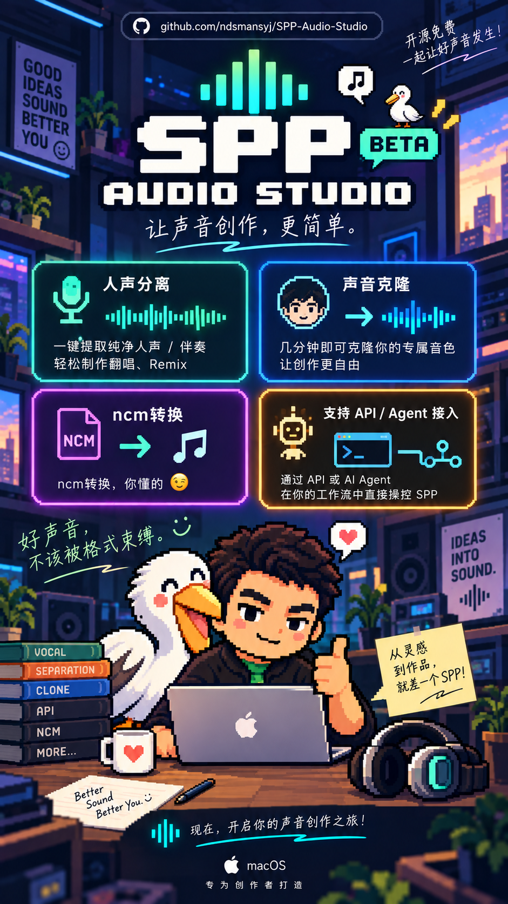

<div align="center">


# SPP Audio Studio

**Mac 上的本地音频工作台**

格式转换 · 人声分离 · 声音克隆

<sub>Apple Silicon · macOS 14+ · 当前处于 RC 测试阶段</sub>

</div>

---

<div align="center">
<a href="assets/poster/spp-audio-studio-poster.png"></a>
</div>

把常用的音频处理放进一个窗口：拖入文件，选择需要的结果，然后导出或试听。

| 功能 | 可以做什么 |
| --- | --- |
| **格式转换** | 批量转换受支持的本地音频格式，导出 MP3 或 FLAC。 |
| **人声分离** | 使用 Mel-Deux 导出人声、伴奏，或同时导出两者。 |
| **声音克隆** | 使用 Qwen3-TTS 和参考音生成语音，支持常用人声模板。 |

## 使用与状态

- 支持 Apple Silicon Mac，目标系统为 macOS 14 及更新版本；暂不支持 Intel Mac。
- 音频默认在本机处理。源文件只读；同名输出会自动加序号。
- AI 功能所需的模型与运行环境可在应用的「模型与环境」页面一键安装，也可链接已有的本地模型。
- `.ncm` 转换会保留文件中已有的歌曲信息和封面；若源文件本身没有内嵌封面，导出文件也可能没有封面。
- 本机脚本可通过 [本机 API](LOCAL_API.md) 调用转换、人声分离和克隆。
- 当前 0.3.0 RC 版本正在跨设备测试。安装包与更新信息见 [Releases](https://github.com/ndsmansyj/SPP-Audio-Studio/releases)；测试反馈可提交 [Issue](https://github.com/ndsmansyj/SPP-Audio-Studio/issues)。

## 下载与首次打开

1. 在 [Releases](https://github.com/ndsmansyj/SPP-Audio-Studio/releases) 下载最新 DMG。
2. 打开 DMG，把 **SPP Audio Studio** 拖到 **Applications**。
3. 当前免费测试版没有 Apple Developer ID。如果 macOS 提示“无法验证开发者”，前往 **系统设置 → 隐私与安全性 → 仍要打开**。

当前版本已自带 Python Core，普通用户**不需要安装 Xcode、Command Line Tools、Homebrew 或系统 Python**。

首次使用 AI 功能时，在「模型与环境」页面点击 **一键下载并安装**；也可以分别安装所需组件。

遇到问题时，打开「模型与环境」→ **复制诊断报告**，直接把文字粘贴到群里或 GitHub Issue；报告默认隐藏用户名、完整文件路径和声音克隆正文。

## 从源码构建

项目由 SwiftUI 界面和 Python Worker 组成。构建脚本面向 Apple Silicon macOS，并需要本机可用的 Swift 编译环境与 Python 3.11 Core。

```bash
./scripts/build_local.sh
```

## 许可证

项目代码采用 [MIT License](LICENSE)。默认演示人声、像素头像/品牌图标和第三方模型分别遵循独立条款；使用或再分发前请阅读 [人声素材说明](VOICE_ASSET_LICENSE.md)、[品牌与肖像素材说明](BRANDING_ASSET_LICENSE.md) 与 [第三方声明](THIRD_PARTY_NOTICES.md)。Mel-Deux 模型采用 **CC BY-NC 4.0**，不适用于商业用途。
