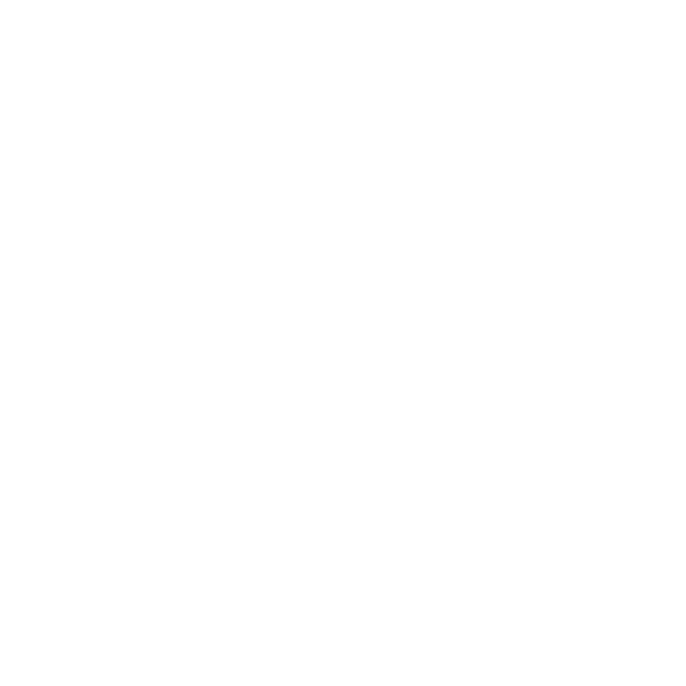

# SPP Audio Studio

一个面向 Apple Silicon Mac 的本地音频工作台，把三件高频杂活收进一个原生 macOS App：

- 本地特殊格式转换
- Mel-Deux 人声 / 伴奏分离
- Qwen3-TTS 声音克隆
- 常用人声模板
- 处理结果一键试听

> 当前版本：0.2.0-rc6（干净 Mac 群测）

## 设计目标

SPP Audio Studio 不是 DAW，也不做复杂波形编辑。它只想把常用的音频处理流程做成：拖进去、选一下、出结果。

核心原则：

- 源文件只读，不移动、不删除、不静默覆盖
- 输出同名时自动加序号
- 模型优先本地运行
- 支持已有模型直接链接，避免重复占空间
- 所有功能尽量在一个窗口里完成

## 功能

### 1. 特殊格式转换

- 支持批量拖入受支持的本地特殊格式文件
- 输出原始 MP3 / FLAC
- 可选择输出到源文件旁边或自定义目录
- 转换完成可直接试听

说明：本工具只处理用户本地已有文件，不提供音乐下载功能。请只处理你有权使用的音频文件。

### 2. 人声分离

基于 Mel-Deux / audio-separator，支持：

- 仅伴奏（默认，适合去人声）
- 仅人声
- 人声 + 伴奏
- MP3 / FLAC / WAV / M4A 等常见音频输入
- 输出目录记忆
- 完成后直接试听

### 3. 声音克隆

基于 Qwen3-TTS + MLX：

- 常用人声模板
- 临时参考音
- 默认内置“盼盼 · 自然口播”测试模板
- 默认预填测试文稿
- 自定义导出目录
- 完成后直接试听

## 系统要求

- Apple Silicon Mac（M1 / M2 / M3 / M4 及后续 Apple Silicon）
- 当前测试目标：macOS 14+
- Intel Mac 暂不支持

## 安装

到 GitHub Releases 下载最新 DMG，打开后将 SPP Audio Studio 拖入 Applications。

### 首次打开被 macOS 阻止怎么办？

当前测试版没有购买 Apple Developer ID，因此首次打开可能出现“无法验证开发者”。这是当前免费分发方式下的预期情况。

处理方法：

1. 打开 系统设置
2. 进入 隐私与安全性
3. 找到 SPP Audio Studio 被阻止的提示
4. 点击 仍要打开

之后正常使用即可。

## 模型与环境

模型页支持三种下载源：

- 自动（默认，HF 镜像优先，失败后切官方）
- HF 镜像
- Hugging Face 官方

默认模型：

- Qwen3-TTS 1.7B 8bit：约 3.1 GB
- Mel-Deux：约 435 MB

如果你本机已经有模型，也可以直接“链接本地”，不会复制模型文件。

### RC6：干净 Mac 运行环境

RC6 已把 Python Core 直接打进 App。普通用户不需要安装：

- Xcode / Command Line Tools
- Homebrew
- 系统 Python

Qwen 与 Mel 的“模型”和“运行环境”分开管理：模型仍通过 Hugging Face / 镜像下载；推理 Runtime 可以在“模型与环境”页面直接安装。Runtime 安装只使用预编译包，不要求本机编译。

干净 Mac 首次使用 AI 功能时建议按顺序：

1. 安装对应 Runtime
2. 下载对应模型
3. 回到人声分离 / 声音克隆使用

如果安装失败，可以直接点击“复制诊断报告”发到 Issue 或群里，不需要打开 Terminal。

当前仍处于 RC 群测阶段，最重要的测试项就是不同 Apple Silicon / macOS 组合上的首次 Runtime 安装。新建声音模板时如果把参考文本留空，自动语音转写属于可选能力；默认内置模板不依赖这一步。

## 隐私

- 音频处理默认在本机进行
- SPP Audio Studio 不上传你的项目音频
- 源文件默认只读
- 模型文件保存在本机
- 人声模板保存在用户目录，不会随更新被覆盖

## 默认人声模板说明

仓库内置的默认参考音属于项目作者 宋盼盼，仅用于 SPP Audio Studio 的默认测试 / 演示模板，不属于 MIT License 授权范围。

不要将该参考音单独再分发、制作公开声线包或用于冒充、欺骗。详见 VOICE_ASSET_LICENSE.md。

## 开源与许可证

SPP Audio Studio 自身代码使用 MIT License。

第三方模型和组件保留各自许可证，其中需要特别注意：

- Qwen3-TTS MLX：Apache-2.0
- Mel-Deux：CC BY-NC 4.0（非商业）
- audio-separator：MIT
- mlx-audio：MIT

所以：代码是 MIT，不代表 Mel-Deux 模型也可以商用。详细说明见 THIRD_PARTY_NOTICES.md。

## 从源码构建

项目目前使用 SwiftUI + Python Worker 的轻量结构。

目录大致如下：

    app/                  SwiftUI macOS UI
    worker/               统一 Worker / Qwen bridge
    format_converter/     原生 Swift 格式转换器源码
    assets/default_voice/ 默认演示人声模板
    scripts/              本机构建脚本
    docs/                 测试说明

本机开发构建：

    ./scripts/build_local.sh

当前脚本面向 Apple Silicon，本地环境需要能编译 Swift。

## 群测反馈

请优先反馈：

- 首次启动是否成功
- Finder 拖拽是否正常
- 特殊格式转换是否正常
- 人声分离三种输出是否正常
- 声音克隆是否正常
- 模型下载是否正常
- 干净 Mac 是否能直接启动，不弹 Xcode / python3 安装提示
- Qwen / Mel Runtime 是否能在 App 内安装
- 试听是否正常
- “复制诊断报告”是否能直接粘贴反馈

详细测试清单见 docs/TESTING.md。

## 更新

当前版本先通过 GitHub Releases 手动更新。

后续计划加入：启动时检查 GitHub Release → 提示新版本 → 一键下载新版 DMG。

暂时不会直接从 Git 分支自动覆盖本地程序，避免半成品 commit 破坏用户安装。

## 声明

这是一个个人工具演化出来的开源项目，目前仍处于 RC 测试阶段。请不要把唯一一份重要音频素材只交给任何测试版软件处理；虽然程序设计上不会删除源文件，但重要素材依然建议保留备份。
